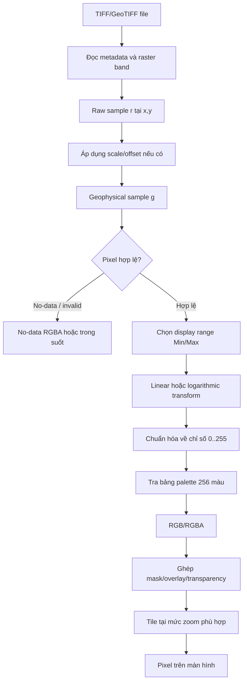

# SNAP TIFF to Display Pixel Pipeline

## 1. Phạm vi

Tài liệu này giải thích cách SNAP biến dữ liệu trong file `.tif` / `.tiff`
thành pixel màu hiển thị trên màn hình, tập trung vào:

- Giá trị số của pixel;
- No-data và valid mask;
- Thống kê, histogram và display range;
- Linear/log scaling;
- Palette, Scheme và nội suy màu;
- Chuyển giá trị dữ liệu thành RGB/RGBA;
- Ảnh pyramid, tile và mức zoom.

Luồng chính được mô tả cho **TIFF một band chứa dữ liệu số**, ví dụ DEM,
backscatter SAR, chỉ số hoặc một band quang học. TIFF RGB và TIFF có bảng màu
nhúng được trình bày riêng ở cuối.

> [!IMPORTANT]
> Pixel dữ liệu và pixel màn hình không phải cùng một thứ. Một pixel TIFF có
> thể chứa `UInt16`, `Float32` hoặc `Float64`, trong khi pixel hiển thị cuối
> cùng thường là RGB/RGBA 8-bit. Colour Manipulation chỉ thay đổi phép ánh xạ
> sang màu; nó không sửa giá trị raster gốc.

## 2. Luồng tổng quát



Có thể rút gọn phần màu thành:

```text
raw value
  → physical/geophysical value
  → valid/invalid
  → normalized display position
  → 8-bit palette index
  → RGB/RGBA
  → screen pixel
```

## 3. Bước 1 — SNAP đọc cấu trúc TIFF

Khi mở file, SNAP xác định:

- Kích thước raster: width × height;
- Số band;
- Kiểu dữ liệu của mỗi sample: byte, integer, float...;
- Tile/strip layout và các overview nếu có;
- No-data value;
- Scale factor và offset nếu metadata cung cấp;
- Color map nhúng, nếu TIFF là ảnh indexed-color;
- GeoTIFF tags: CRS, affine transform, pixel size và vị trí địa lý.

Mỗi kênh TIFF thường trở thành một `Band` trong SNAP. Dữ liệu không nhất thiết
được đọc toàn bộ vào RAM. SNAP tạo nguồn ảnh nhiều mức và chỉ đọc các tile cần
cho vùng đang quan sát.

GeoCoding quyết định pixel được đặt ở đâu trên bản đồ, nhưng không trực tiếp
quyết định pixel có màu gì.

## 4. Bước 2 — Từ raw sample sang geophysical sample

Gọi:

- `r`: raw sample được lưu trong TIFF;
- `scale`: scaling factor;
- `offset`: scaling offset;
- `g`: giá trị geophysical/physical dùng bởi SNAP.

Trường hợp thông thường:

```text
g = r × scale + offset
```

Nếu band được khai báo là log10-scaled ở cấp dữ liệu:

```text
g = 10^(r × scale + offset)
```

Mặc định, nếu file không cung cấp thông tin khác:

```text
scale  = 1
offset = 0
g      = r
```

### Hai loại “log” cần phân biệt

| Loại | Ý nghĩa |
|---|---|
| Band `log10Scaled` | Cách giải mã giá trị lưu trong file thành giá trị vật lý |
| Log Scaling trong Colour Manipulation | Cách phân bố màu khi hiển thị |

Hai cơ chế này nằm ở hai tầng khác nhau. Với backscatter đã ở đơn vị dB, dữ
liệu đã là logarithmic về ý nghĩa vật lý; thông thường nên dùng **linear
display scaling**, không log thêm lần nữa.

## 5. Bước 3 — Xác định pixel hợp lệ

Một sample có thể bị coi là không hợp lệ nếu:

- Bằng no-data value của TIFF;
- Không thỏa `validPixelExpression`;
- Nằm ngoài ROI hoặc valid mask;
- Thuộc vùng trống sinh ra khi mosaic/reprojection;
- Bị mask chất lượng loại bỏ.

Pixel invalid không nên tham gia vào:

- Thống kê dùng để chọn display range;
- Histogram;
- Phép ánh xạ màu thông thường.

Sau khi ảnh màu được tạo, SNAP dùng valid-mask để sơn pixel invalid bằng
`noDataColor`. Màu này có thể trong suốt, vì vậy có thể nhìn thấy background
hoặc layer phía dưới.

> [!CAUTION]
> Nếu TIFF có một giá trị nền như `0` nhưng không khai báo nó là no-data,
> SNAP có thể tính `0` vào histogram. Kết quả là range bị kéo lệch và phần dữ
> liệu có ích bị dồn vào một đoạn màu hẹp.

## 6. Bước 4 — Tính thống kê và histogram

Để hiển thị một band số, SNAP cần biết miền dữ liệu đáng quan tâm. Đối tượng
thống kê của SNAP (`Stx`) cung cấp các thông tin như:

- Minimum và maximum;
- Mean và standard deviation;
- Histogram bins;
- Phân bố pixel hợp lệ.

### Vì sao không luôn dùng minimum/maximum tuyệt đối?

Một vài outlier có thể làm mất tương phản:

```text
99.9% pixel nằm trong 20..200
1 pixel lỗi có giá trị 65535
```

Nếu stretch theo `20..65535`, gần như toàn bộ ảnh sẽ bị dồn về màu đầu
palette. Vì vậy SNAP thường loại một phần nhỏ ở hai đuôi histogram.

### Default ImageInfo của SNAP

Khi chưa có ImageInfo hoặc palette riêng, logic mặc định của core SNAP:

```text
Bỏ 1% diện tích histogram bên trái
Bỏ 4% diện tích histogram bên phải
```

Tức là mặc định giữ khoảng 95% phân bố để tạo contrast stretch. Nếu range tìm
được bị suy biến (`Min == Max`), SNAP quay về minimum/maximum của histogram.

Palette ban đầu cho band liên tục gồm:

```text
Min    → Black
Center → Gray
Max    → White
```

Trong đó center được tính sao cho phù hợp với scaling của band.

### Nút `From Data`

Trong Colour Manipulation, `From Data` dùng percentile được cấu hình trong
Preferences. Giá trị mặc định hiện tại của SNAP là:

```text
92% dữ liệu
```

Đây là một thao tác chọn range từ histogram. Nó không đổi dữ liệu TIFF.

## 7. Bước 5 — Chọn nguồn của display range

Display range `[Min, Max]` có thể đến từ nhiều nguồn:

| Nguồn | Ý nghĩa |
|---|---|
| Default stretch | SNAP tự suy ra từ histogram |
| `From Data` | Lấy range percentile từ dữ liệu hiện tại |
| `From Palette` | Lấy range gốc ghi trong `.cpd`/`.cpt` |
| Scheme | Lấy `MIN`/`MAX` từ color scheme |
| Người dùng | Nhập trực tiếp Min và Max |
| `Load exact values` | Giữ nguyên sample values của palette thay vì co giãn |

Hai giá trị này có ý nghĩa:

```text
g <= Min  → màu đầu palette
g >= Max  → màu cuối palette
Min < g < Max → màu nằm giữa
```

Giá trị ngoài range không bị xóa khỏi dữ liệu; nó chỉ bị **clip màu** ở hai
đầu palette.

## 8. Bước 6 — Palette được biểu diễn như thế nào?

Palette của SNAP chứa nhiều control point:

```text
Point 0: sample s0, color C0
Point 1: sample s1, color C1
...
Point n: sample sn, color Cn
```

Mỗi màu có bốn thành phần:

```text
Color = (Red, Green, Blue, Alpha)
```

Mỗi channel nằm trong khoảng `0..255`. Alpha bằng `0` là trong suốt; alpha
bằng `255` là hoàn toàn đục.

Một file `.cpd` điển hình:

```text
numPoints=3
color0=0,0,0
color1=128,128,128
color2=255,255,255
sample0=0
sample1=0.5
sample2=1
```

`numColors` mặc định của `ColorPaletteDef` là **256**. Các control point
không đồng nghĩa với chỉ có từng ấy màu; SNAP dựng một lookup table có tối đa
256 màu từ chúng.

## 9. Bước 7 — Co giãn palette vào range hiện tại

Khi chọn palette mà `Load exact values` không được bật, SNAP chuyển các sample
point từ range nguồn `[Smin, Smax]` sang range đích `[Min, Max]`.

Với palette tuyến tính:

```text
weight = (s - Smin) / (Smax - Smin)
targetSample = Min + weight × (Max - Min)
```

Ví dụ:

```text
Palette nguồn: 0, 0.25, 1
Range màn hình: 100..500

0    → 100
0.25 → 200
1    → 500
```

Khoảng cách tương đối giữa các control point được giữ nguyên.

Nếu palette nguồn hoặc display đích dùng log, SNAP chuyển qua trọng số tuyến
tính tương đương rồi dựng sample target theo trạng thái log đích. Mục tiêu
vẫn là bảo toàn vị trí tương đối của màu, nhưng trong không gian linear/log
thích hợp.

Khi bật `Load exact values`, SNAP giữ nguyên sample values trong file palette;
range hiển thị có thể thay đổi theo range gốc của palette.

## 10. Bước 8 — Chuẩn hóa một sample hợp lệ

### Linear display

Với geophysical sample `g`:

```text
t = (g - Min) / (Max - Min)
```

Sau đó:

```text
t < 0 → 0
t > 1 → 1
```

### Logarithmic display

Với các giá trị dương:

```text
t = (log10(g) - log10(Min))
    / (log10(Max) - log10(Min))
```

SNAP thực hiện phép biến đổi tương đương trên source image trước khi rescale.

> [!CAUTION]
> Log display cần miền giá trị hợp lệ cho logarithm. Min bằng `0`, giá trị âm
> hoặc dữ liệu đã ở dB có thể tạo kết quả không có ý nghĩa. Với band dB, dùng
> linear display trên chính khoảng dB.

## 11. Bước 9 — Chuyển sang chỉ số palette 8-bit

Sau khi chọn linear/log space, SNAP rescale về một byte index:

```text
index ≈ clamp(255 × t, 0, 255)
```

Tương đương với:

```text
factor = 255 / (Max - Min)
offset = -255 × Min / (Max - Min)
index  = byte(sample × factor + offset)
```

Trong log mode, `sample`, `Min` và `Max` ở công thức thứ hai được hiểu trong
không gian log đã biến đổi.

Kết quả:

```text
0   → đầu palette
127/128 → gần giữa palette
255 → cuối palette
```

Đây là bước lượng tử hóa hiển thị: dữ liệu nguồn có thể là Float64 với hàng
triệu giá trị khác nhau, nhưng palette hiển thị thường có 256 vị trí.

## 12. Bước 10 — Dựng lookup table màu

SNAP dựng trước mảng:

```text
palette[0..255] = RGBA
```

Với mỗi vị trí trong palette:

1. Chuyển index thành sample tương ứng trong range;
2. Tìm hai control point bao quanh;
3. Nội suy các channel R, G, B và A;
4. Làm tròn và giới hạn từng channel về `0..255`.

Giữa hai điểm `(s1, C1)` và `(s2, C2)`:

```text
f = (sample - s1) / (s2 - s1)

R = round(R1 + f × (R2 - R1))
G = round(G1 + f × (G2 - G1))
B = round(B1 + f × (B2 - B1))
A = round(A1 + f × (A2 - A1))
```

### Continuous palette

Màu được nội suy mượt giữa hai control point.

### Discrete palette

SNAP không nội suy. Tất cả vị trí trong một interval dùng màu của control
point bên trái:

```text
[s1, s2) → C1
```

Discrete palette phù hợp với lớp phân loại, cờ hoặc các khoảng chuyên đề.

### Classification band có IndexCoding

Với band phân loại thật sự, SNAP không coi sample là đại lượng liên tục. Mỗi
giá trị integer được ánh xạ trực tiếp sang color index. Giá trị không được
định nghĩa nhận màu no-data/undefined.

## 13. Bước 11 — Tra palette để tạo RGB/RGBA

Với pixel hợp lệ:

```text
screenColorBeforeOverlay = palette[index]
```

Nếu tất cả màu đều opaque, kết quả có ba channel RGB. Nếu palette có alpha,
kết quả có bốn channel RGBA.

Ví dụ:

```text
index = 90
palette[90] = (90, 90, 90, 255)
```

Pixel màu tạm thời là xám với RGB `(90,90,90)`.

## 14. Bước 12 — Histogram matching tùy chọn

Sau khi sample được đưa về byte index và trước lookup RGB, SNAP có thể áp dụng:

- `None`: giữ ánh xạ hiện tại;
- `Equalize`: histogram equalization;
- `Normalize`: histogram normalization.

Histogram matching biến đổi phân bố **index độ sáng**, sau đó mới tra palette.
Vì vậy hai pixel có cùng giá trị dữ liệu vẫn có cùng màu, nhưng quan hệ giữa
giá trị dữ liệu và vị trí palette không còn là phép tuyến tính đơn giản.

Đây là tùy chọn tăng tương phản hiển thị, không sửa raster gốc.

## 15. Bước 13 — No-data, mask và alpha

Sau khi ảnh RGB/RGBA chính được tạo:

1. SNAP lấy valid mask của band;
2. Pixel hợp lệ giữ màu palette;
3. Pixel invalid được thay bằng `noDataColor`;
4. Các mask/overlay được composite lên ảnh;
5. Alpha quyết định tỷ lệ nhìn thấy layer dưới.

Nếu một mask màu `Cm` có độ trong suốt `α`, có thể hình dung phép trộn:

```text
Cout = α × Cm + (1 - α) × Cbase
```

Thứ tự layer ảnh hưởng kết quả cuối cùng. Vì vậy một pixel có màu khác với
palette không nhất thiết do palette sai; nó có thể đang bị mask hoặc overlay
phủ lên.

## 16. Bước 14 — Tile, pyramid và zoom

SNAP xử lý ảnh theo tile và nhiều resolution level:

- Zoom gần: dùng level có độ phân giải cao hơn;
- Zoom xa: dùng level giảm độ phân giải;
- Chỉ tile nhìn thấy hoặc sắp cần mới được đọc/tính;
- Tile trung gian có thể được cache;
- GeoTIFF tile/strip được mosaic thành vùng ảnh cần render.

Luồng màu được tạo lại cho resolution level đang dùng:

```text
level image
  → byte index
  → palette lookup
  → RGB/RGBA tile
```

Do resampling/overview, một pixel màn hình khi zoom xa có thể đại diện cho
nhiều pixel nguồn. Vì vậy:

- Giá trị đọc bằng Pixel Info tại full resolution;
- Màu nhìn thấy ở mức zoom xa;
- Và giá trị thống kê của cả band

không nhất thiết tương ứng một-một theo cách trực giác.

## 17. Ví dụ 1 — Grayscale tuyến tính

Giả sử:

```text
Min = 78.1875
Max = 196.9375
g   = 120
Palette = Black → Gray → White
```

Chuẩn hóa:

```text
t = (120 - 78.1875) / (196.9375 - 78.1875)
  ≈ 0.3521
```

Chỉ số:

```text
index ≈ 255 × 0.3521 ≈ 90
```

Với grayscale:

```text
RGB ≈ (90, 90, 90)
```

Hai trường hợp clipping:

```text
g = 50  → index 0   → Black
g = 200 → index 255 → White
```

Giá trị `50` và `200` vẫn còn nguyên trong raster; chỉ màu bị clip.

## 18. Ví dụ 2 — Log display

Giả sử:

```text
Min = 0.01
Max = 100
g   = 1
```

Trong log10 space:

```text
log10(Min) = -2
log10(Max) =  2
log10(g)   =  0

t = (0 - (-2)) / (2 - (-2)) = 0.5
index ≈ 128
```

Mặc dù `1` không phải trung bình số học của `0.01` và `100`, nó nằm chính
giữa range theo logarithm.

## 19. Ví dụ 3 — Backscatter SAR đã ở dB

Giả sử band `Sigma0_VV_dB`:

```text
Min = -25 dB
Max =   0 dB
g   = -12 dB
Display scaling = Linear
```

```text
t = (-12 - (-25)) / (0 - (-25))
  = 13 / 25
  = 0.52

index ≈ 133
```

Không bật Log Scaling lần nữa vì dB đã là biểu diễn logarithmic của công suất.

## 20. Các nhánh TIFF đặc biệt

### 20.1 TIFF có ColorMap nhúng

Nếu TIFF chứa tag `ColorMap` và sử dụng indexed color model:

- Sample integer là chỉ số màu;
- SNAP lấy RGB trực tiếp từ color table nhúng;
- Mỗi index trở thành một palette point;
- Không cần tạo grayscale stretch mặc định.

Đây thường là raster phân loại hoặc ảnh đã được tô màu trước.

### 20.2 TIFF RGB/RGBA

Với TIFF ba hoặc bốn channel:

```text
R band → red channel
G band → green channel
B band → blue channel
Alpha  → transparency, nếu có
```

Mỗi channel vẫn có thể có range/stretch riêng trước khi được ghép thành RGB.
Single-band palette pipeline không áp dụng nguyên xi cho trường hợp này.

### 20.3 GeoTIFF và TIFF thường

Khác biệt chính của GeoTIFF là có thông tin tọa độ. Phép chuyển sample sang màu
về cơ bản giống TIFF thường; GeoTIFF bổ sung vị trí địa lý và phép biến đổi
pixel-to-map.

## 21. Tác động của các điều khiển trong Colour Manipulation

| Điều khiển | Thay đổi gì? | Có sửa dữ liệu TIFF không? |
|---|---|---|
| Scheme | Palette + Range + Linear/Log | Không |
| Palette | Bảng màu/control points | Không |
| Min/Max | Miền dữ liệu ánh xạ lên palette | Không |
| From Data | Tính range từ histogram | Không |
| From Palette | Khôi phục range nguồn của palette | Không |
| Load exact values | Giữ sample values trong palette | Không |
| Reverse | Đảo thứ tự màu, không đảo dữ liệu | Không |
| Log Scaling | Đổi không gian phân bố màu | Không |
| Sliders/Table | Sửa vị trí và màu control point | Không |
| Mask transparency | Đổi cách composite layer | Không |

## 22. Những hiểu nhầm thường gặp

### “Pixel TIFF 16-bit được chuyển thẳng thành RGB”

Không. Nó được scale/stretch về palette index `0..255`, sau đó index mới được
tra thành RGB/RGBA.

### “Thay palette làm thay đổi giá trị ảnh”

Không. Palette chỉ đổi cách nhìn.

### “Min/Max là min/max thật của file”

Không nhất thiết. Chúng thường là percentile stretch hoặc range của Scheme.

### “Màu trắng nghĩa là pixel có giá trị 255”

Không nhất thiết. Màu trắng thường nghĩa là pixel đã tới cuối display range.
Giá trị thật có thể là `0.5`, `196.9375`, `10000` hoặc bất kỳ đơn vị nào.

### “Log Scaling và dữ liệu dB là cùng một nút”

Không. dB là cách biểu diễn đại lượng; Log Scaling là phép ánh xạ màu trong UI.

### “Màu trên màn hình luôn chỉ do palette”

Không. Valid mask, no-data color, alpha, mask overlay, layer order và mức zoom
đều có thể làm thay đổi màu cuối cùng.

## 23. Checklist khi màu hiển thị có vẻ sai

1. Kiểm tra band đang xem và đơn vị;
2. Kiểm tra raw/geophysical value bằng Pixel Info;
3. Kiểm tra no-data value có được bật đúng không;
4. Kiểm tra Min/Max có bị outlier kéo lệch không;
5. Thử `From Data`;
6. Xác định dữ liệu tuyến tính hay đã ở dB;
7. Kiểm tra Log Scaling;
8. Kiểm tra Scheme có phù hợp đại lượng không;
9. Kiểm tra `Load exact values`;
10. Kiểm tra palette có discrete hay continuous;
11. Tắt mask/overlay để so sánh;
12. So sánh ở mức zoom gần và xa;
13. Kiểm tra TIFF có ColorMap nhúng hay không.

## 24. Tóm tắt công thức

```text
# Decode
g = r × scale + offset

# Linear display
t = (g - Min) / (Max - Min)

# Log display
t = (log10(g) - log10(Min))
    / (log10(Max) - log10(Min))

# Quantize
index = clamp(255 × t, 0, 255)

# Color lookup
RGBA = palette[index]

# Composite
screenPixel = composite(RGBA, noDataMask, overlays, background)
```

Đây là mô hình logic ngắn gọn nhất cho một band TIFF liên tục. SNAP triển khai
theo tile và image pyramid để tránh phải xử lý toàn bộ ảnh ở mỗi lần redraw.

## 25. Nguồn SNAP đã đối chiếu

- `snap-geotiff/.../GeoTiffProductReader.java`: tạo Product/Band, no-data,
  GeoCoding và indexed color table;
- `snap-geotiff/.../GeoTiffMultiLevelSource.java`: đọc tile và resolution
  level theo yêu cầu;
- `snap-core/.../RasterDataNode.java`: raw/geophysical scaling, Stx và default
  ImageInfo;
- `snap-core/.../ImageInfo.java`: trạng thái palette, range, log, no-data và
  histogram matching;
- `snap-core/.../ColorPaletteDef.java`: control points, số màu, discrete và
  palette metadata;
- `snap-core/.../ImageManager.java`: rescale về byte index, tạo lookup table,
  nội suy RGBA, valid-mask và composite;
- `snap-core/.../ColoredBandImageMultiLevelSource.java`: tạo ảnh màu cho từng
  resolution level.
